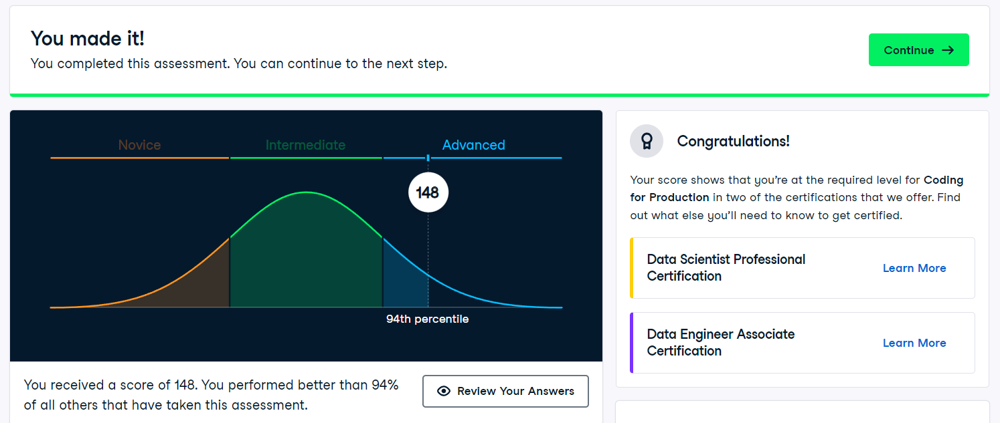
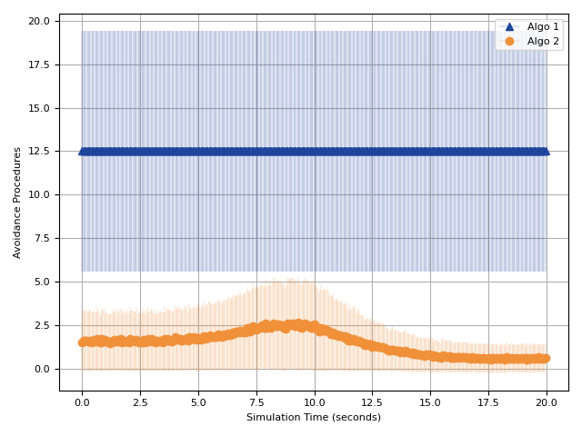
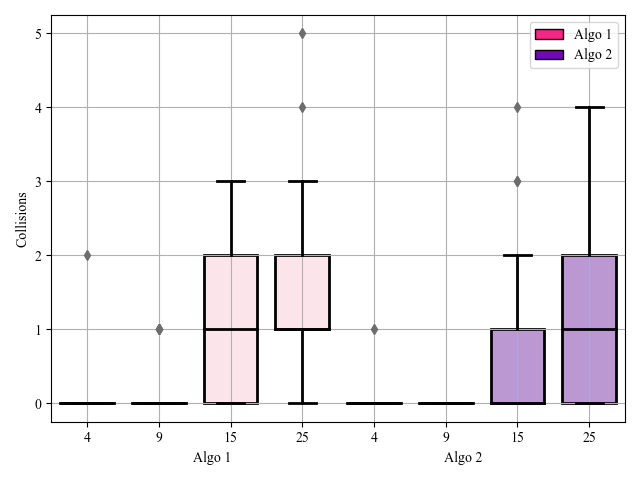

# DataVisualization
Data visualization on experimental data utilizing "seaborn", "matplotlib", "pandas" to generate visually engaging graphs

## Data Camp - Intermediate Python Programming Score


## Example Plots
The results were generated using the data gathered during collision avoidance experimentations. Matplotlib and Seaborn packages were used to generate the below results along with numpy adn randas to make the computations efficient. 
1. Line Plot: This plot represent the variation of in range obstacles for each agent during the experiment's duration.

  
2. Box Plot: This plot represents the total number of collisions during each experiment.


## Uploading Large Files Git-lfs
```
 If already the large files have been committed and got the error then the first commit must be undone
 Using git desktop can be faster on windows

git reset
git lfs track '*.csv'
git add .
git commit -m "Commit Message"
git push
```
